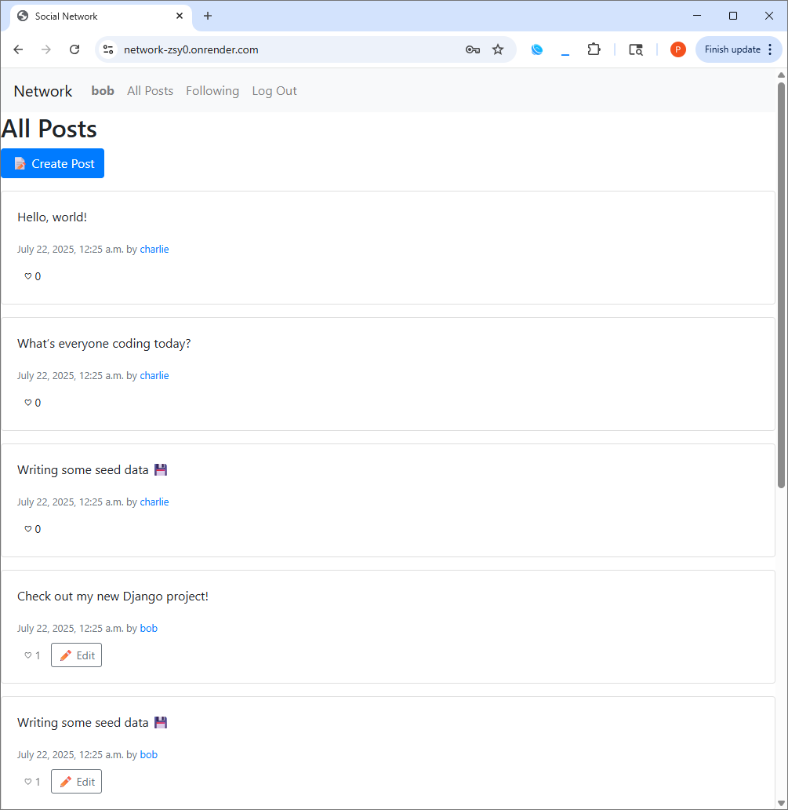
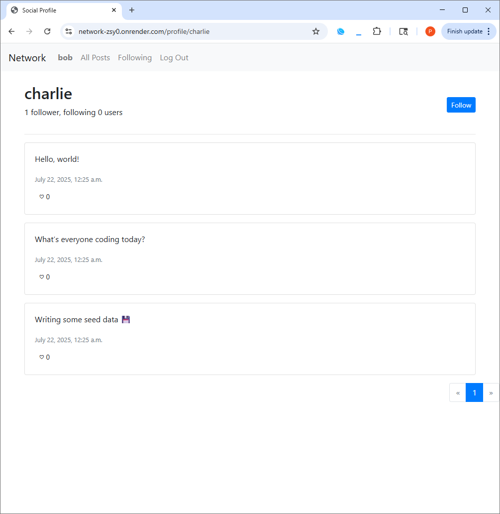
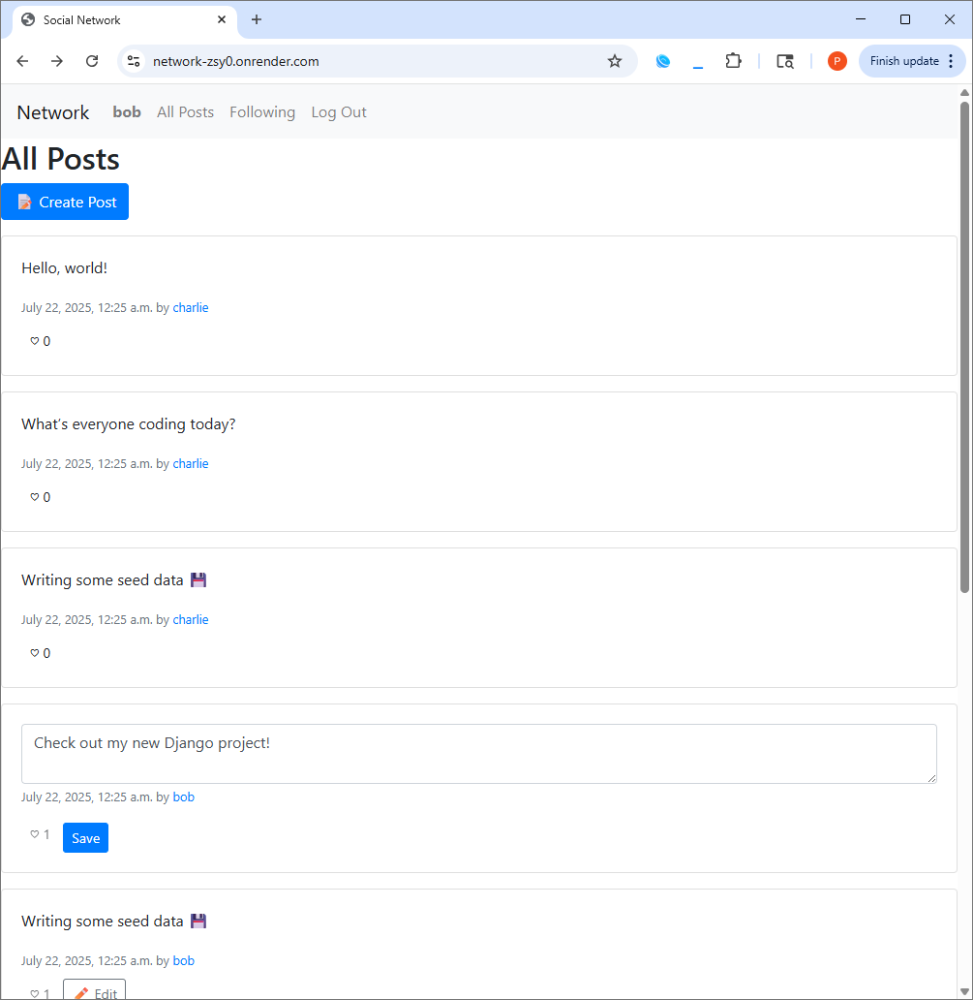
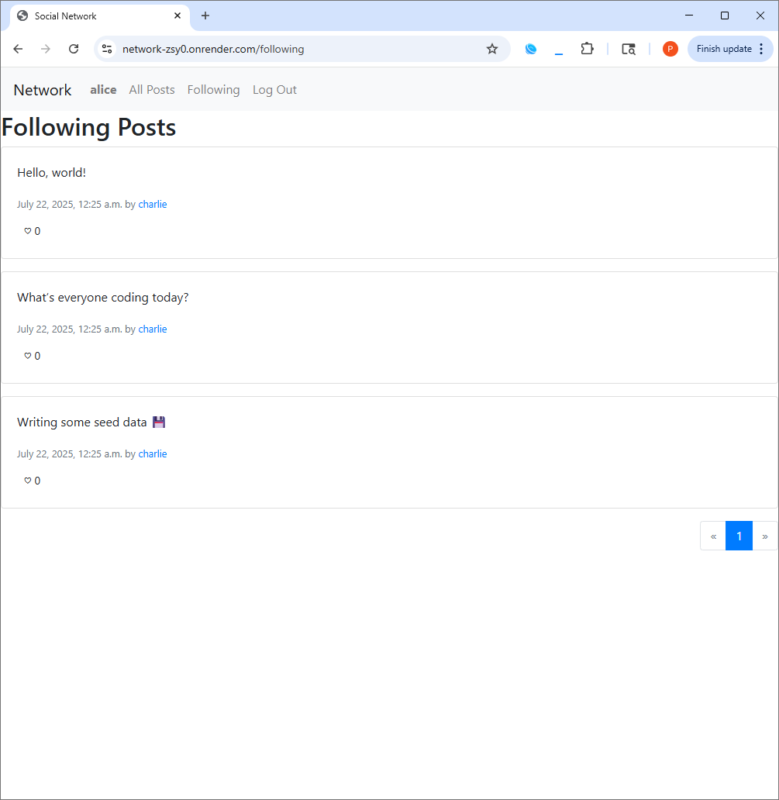

# 🌐 Network

**Built for [CS50’s Web Programming with Python and JavaScript (CS50W)](https://cs50.harvard.edu/web/).**  
A Twitter-style social network where users can post, follow others, like posts, and explore a global feed with pagination and AJAX interactivity.

---

## 🚀 Features

- User authentication (register, login, logout)
- Create and edit text-based posts
- View all posts, following feed, and user profiles
- Like/unlike posts with live feedback (AJAX)
- Follow/unfollow users (AJAX)
- Paginated feeds with next/previous controls
- Responsive design using Bootstrap

---

## 📸 Screenshots

<p float="left">
   
   
   
    
</p>

---

## 🛠️ Tech Stack

- **Backend:** Django (Python)
- **Frontend:** HTML, CSS, Bootstrap
- **JavaScript:** Vanilla JS with Fetch API
- **Database:** SQLite
- **AJAX:** Fetch API for asynchronous operations
- **Auth:** Django’s built-in authentication system

---

## ▶️ Live Demo

- 🌐 Live site: [https://network-zsy0.onrender.com](https://network-zsy0.onrender.com)
- 📺 Video demo: [Watch on YouTube](https://youtu.be/CaqB9SYd2_k)

---

## 🧪 Testing Tips

- Use pre-seeded accounts to test:
  - alice / testpass
  - bob / testpass
  - charlie / testpass
- Create posts from different users and view global feed
- Like and unlike posts from various accounts
- Follow and unfollow users to personalize your feed
- Edit your own posts and view changes without reloading

---

## 📦 Setup Instructions

1. **Clone the repository:**

   ```bash
   git clone https://github.com/phillip-l-rogers/network.git
   cd network
   ```
   
2. **Create and activate a virtual environment:**

   ```bash
   python -m venv venv
   source venv/bin/activate    # On Windows: venv\Scripts\activate
   ```

3. **Install dependencies:**

   ```bash
   pip install -r requirements.txt
   ```

4. **Apply migrations:**

   ```bash
   python manage.py migrate
   ```

5. **Run the development server:**

   ```bash
   python manage.py runserver
   ```
   
6. **Visit:**

   `http://127.0.0.1:8000/` in your browser.
   
---

## 📁 Project Structure

```bash
network/
├── network/          # Main app
│   ├── models.py
│   ├── views.py
│   ├── urls.py
│   └── templates/
├── manage.py
└── requirements.txt
```

---

## 📚 Acknowledgments

- This project was completed as part of [CS50’s Web Programming with Python and JavaScript (CS50W)](https://cs50.harvard.edu/web/)
- Built using Django for backend and Bootstrap with JavaScript for interactivity

---

## 📜 License

- This project was completed as part of Harvard CS50W. Educational use only.
